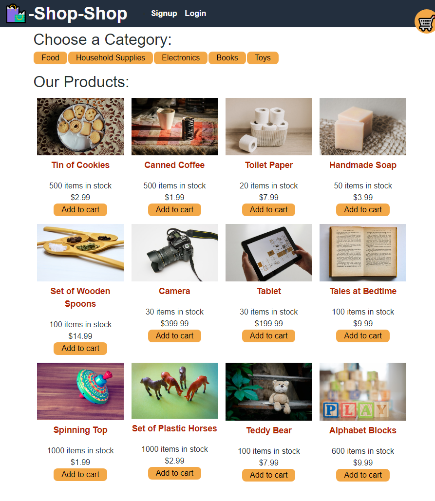

# State: Redux Store


## Description

This app is an example of an e-commerce shopping platform. It uses Redux to manage the global state instead of the Context API. By using Redux, it allows the state managemnet system to be taken out of the React ecosystem, which gives a centralized state managemnet. All components are able to access the same state so that the application is more easily in sync. It also allows for pure reducer functions, which is what we want in a React environment. All these things allow for a
predictable state container for the app.

When a user opens the app, they are greated with shopping page with categories and products to choose from. Users can sign-in or sign-up. Users can add products to their cart by clicking add to cart. Once an item is added to the cart, a user can also specify the quanity in the now filled cart with their item(s). Users can also remove items from their cart. Once a user finishes filling their cart, they can checkout. Clicking on a category will filter the product listing options to match those products of the category.

## Table of Contents

- [Installation](#installation)
- [Usage](#usage)
- [Contribution](#contribution)
- [Tests](#test)
- [Questions](#questions)
- [License](#license)

## Installation

1. To install just clone this repo:

```
git clone git@github.com:hculp/readme-generator.git
```

2. Install packages with npm:

```
npm i
```

3. Seed the database:

```
npm run seed
```

## Usage

To run this app locally, just use npm:

```
npm run develop
```

Here are a few example images and gifs of the app's functionality.
This is an image of the app when first opened.



The following animation shows how a user can register using the Signup page and then navigate to the Products page:


The following animation shows how the user can select a category, choose a product, view details about it on the product page, and add and remove it from their shopping cart:


Finally, the user can check out by going to their shopping cart, as shown in the following animation:


## Contribution

Contribution falls under open MIT license.

## Tests

While no specific test are given here, a set of packages in the client package.json are already available for setting up test, along with a test folder (`__test__`) under the client directory.

## Questions

Send any questions or feedback to the following contacts:

- GitHub: [https://github.com/hculp](https://github.com/hculp)
- Email: [howacul@gmail.com](mailto:howacul@gmail.com)

## License

    Copyright (C) 2023 Houston Culpepper.

    Distributed under the MIT License.

[Link to MIT license](https://choosealicense.com/licenses/mit)
